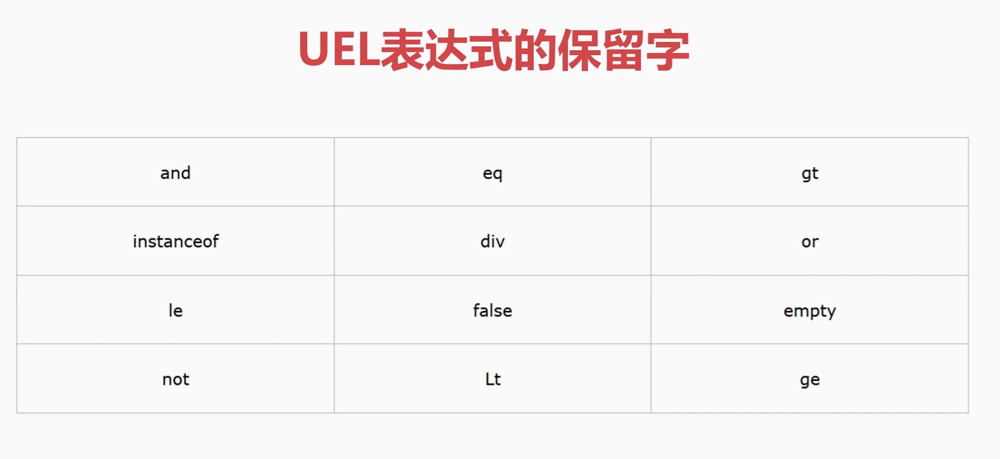
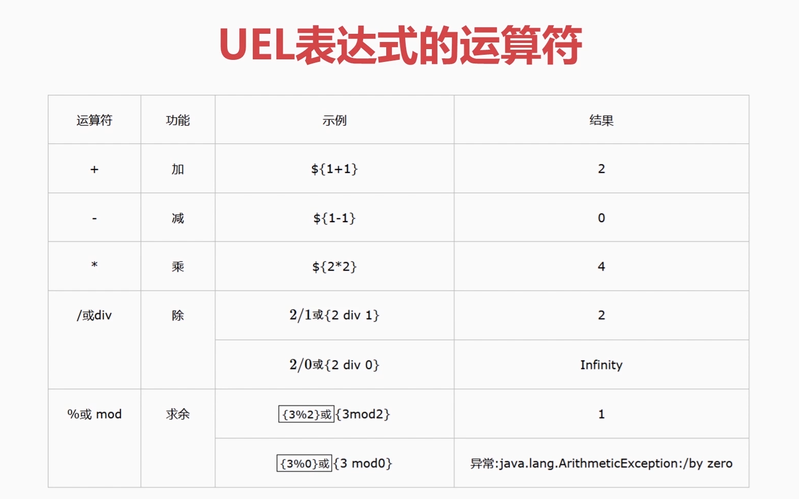

# Spring-Boot整合Activiti7
**工作流基础流程**

部署(Deployment) --->  流程定义(ProcessDefinition) ---> 初始化实例(ProcessInstance)  ---> 任务执行(Task)
## Deployment类

```java
   @Autowired
    private RepositoryService repositoryService;


    // 通过bpmn部署流程
    @Test
    public void initDeploymentBPMN() {
        String filename = "BPMN/Part1_Deployment.bpmn20.png";
        Deployment deployment = repositoryService.createDeployment()
                .addClasspathResource(filename)
//                .addClasspathResource("BPMN/Part1_Deployment.bpmn20.xml")
                .name("流程部署测试V2-BPMN")
                .deploy();
        System.out.println(deployment.getName());
    }

    // 通过zip部署流程
    @Test
    public void initDeploymentZIP() {
        String fileName = "BPMN/deployment.zip";
        InputStream fileInputStream = this.getClass()
                .getClassLoader()
                .getResourceAsStream(fileName);
        ZipInputStream zip = new ZipInputStream(fileInputStream);
        Deployment deployment = repositoryService.createDeployment()
                .addZipInputStream(zip)
                .name("流程部署zip")
                .deploy();
        System.out.println(deployment.getName());
    }

    // 查询流程部署
    @Test
    public void getDeployment() {
        List<Deployment> list = repositoryService.createDeploymentQuery().list();
        for (Deployment dep : list) {
            System.out.println("name: " + dep.getName());
            System.out.println("id: " + dep.getId());
            System.out.println("DeploymentTime: " + dep.getDeploymentTime());
            System.out.println("Key: " + dep.getKey());
        }
    }
```
## 流程定义ProcessDefinition
* Deployment: 添加资源文件、获取部署信息、部署时间
* ProcessDefinition: 获取版本号、key、资源名称、部署ID等
* ProcessDefinitionQuery: 查询流程定义
```java
    @Autowired
    private RepositoryService repositoryService;


    // 查询流程定义
    @Test
    public void getDeployment(){
        List<ProcessDefinition> list = repositoryService.createProcessDefinitionQuery()
                .list();
        for (ProcessDefinition pd : list){
            // 获取名字
            System.out.println("Name: "+pd.getName());
            // 获取key
            System.out.println("Key: "+pd.getKey());
            // 获取资源名称
            System.out.println("ResourceName: "+pd.getResourceName());
            // 获取id
            System.out.println("DeploymentId: "+pd.getDeploymentId());
            // 获取版本
            System.out.println("Version: "+pd.getVersion());
        }
    }
    
    // 删除流程定义
    @Test
    public void delDefinition(){
        String pdID = "a9b39f24-a54d-11ee-bcfc-782b46d17275";
        // 参数为true的话，删除所有流程实例，历史（删除所有历史记录）/ false 留痕
        repositoryService.deleteDeployment(pdID,true);
        System.out.println("删除流程定义成功");
    }
```

## 流程实例ProcessInstance
* ProcessInstance: 启动流程实例、获取流程实例ID、获取流程定义ID、获取流程定义Key、获取流程实例状态、获取流程实例
* ProcessDefinition 与 ProcessInstance 是一对多关系
```java
// 注入运行实例类
    @Autowired
    private RuntimeService runtimeService;

    // 初始化流程实例
    @Test
    void initProcessInstance() {
        ProcessInstance processInstance = runtimeService
                // 1. 获取页面表单内容、请假时间、请假事由、String、formData（个人业务表）
                // 2. fromData 写入业务表，返回业务表主键 ID == businessKey
                // 3. 把业务数据与 Activiti7流程数据关联
                .startProcessInstanceByKey("Part1_Deployment", "bKey001");
        System.out.println("流程实例ID：" + processInstance.getProcessDefinitionId());
    }

    // 获取流程实例列表
    @Test
    void getProcessInstance() {
        List<ProcessInstance> list = runtimeService.createProcessInstanceQuery().list();
        for (ProcessInstance pi : list) {
            System.out.println("-----流程实例----");
            System.out.println("ProcessInstanceId: " + pi.getProcessInstanceId());
            System.out.println("ProcessDefinitionId(): " + pi.getProcessDefinitionId());
            System.out.println("isEnded: " + pi.isEnded());
            System.out.println("isSuspended: " + pi.isSuspended());
        }
    }

    // 暂停与激活流程实例（单个）
    @Test
    void activitieProcessInstance() {
        // 挂起流程实例
//        runtimeService.suspendProcessInstanceById("1989127a-a559-11ee-bda5-782b46d17275");
//        System.out.println("挂起流程实例结束");
        // 激活流程实例
        runtimeService.activateProcessInstanceById("1989127a-a559-11ee-bda5-782b46d17275");
        System.out.println("激活流程实例结束");
    }

    // 删除流程实例（单个）
    @Test
    void deltProcessInstance() {
        // s 删除实例id   s1 删除理由
        runtimeService.deleteProcessInstance("1989127a-a559-11ee-bda5-782b46d17275", "删除");
        // 删除流程实例
        System.out.println("删除流程实例结束");
    }
```

## 任务Task
* Task: 获取任务ID、获取任务名称、获取任务创建时间、获取任务办理人、获取任务办理 

**用户属性面板**
* Assignee: 执行人/代理人
* Candidate Users: 候选人
* Candidate Groups: 候选组
* Due Date: 任务到期时间


## 查询历史记录
* 历史综合信息: HistoricProcessInstance、HistoricTaskInstance、HistoricDetail、HistoricVariableInstance
* 历史变量信息: HistoricVariableInstance
```java
// 根据用户名查询历史记录
public void HistoricTaskInstanceByUser(){
    List<HistoricTaskInstance> list=historyService
        .createHistoricTaskInstanceQuery()
        .orderByHistoricTaskInstanceEndTime().asc()
        .taskAssignee("bajie")
        .list();
    for(HistoricTaskInstance hi:list){
        System.out.println("Id："+hi.getId());
        System.out.println("ProcessInstanceId："+hi.getProcessInstanceId());
        System.out.println("Name："+hi.getName());
    }
}

// 根据流程实例ID查询历史
public void HistoricTaskInstanceByPiID(){
    List<HistoricTaskInstance> list = historyService
        .createHistoricTaskInstanceQuery()
        .orderByHistoricTaskInstanceEndTime().asc()
        .processInstanceId("1f2314cb-cefa-11ea-84aa-dcfb4875e032")
        .list();
    for(HistoricTaskInstance hi : list){
        System.out.println("Id："+ hi.getId());
        System.out.println("ProcessInstanceId："+ hi.getProcessInstanceId());
        System.out.println("Name："+ hi.getName());
    }
}
```
# UEL 表达式
* 表达式描述以 "${"开始，以"}" 结束，例如 ${day>100}
* 支持逻辑运算 ${userName == "bajie" and pwd == "123"}
* 支持变量与实体类赋值 

对应Activiti数据表 
* act_ru_variable运行时参数表
* act_hi_varinst历史参数表 

