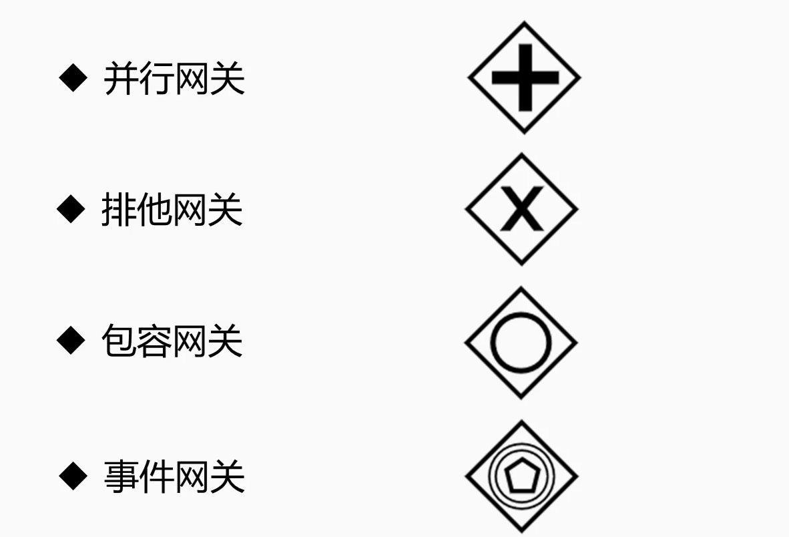
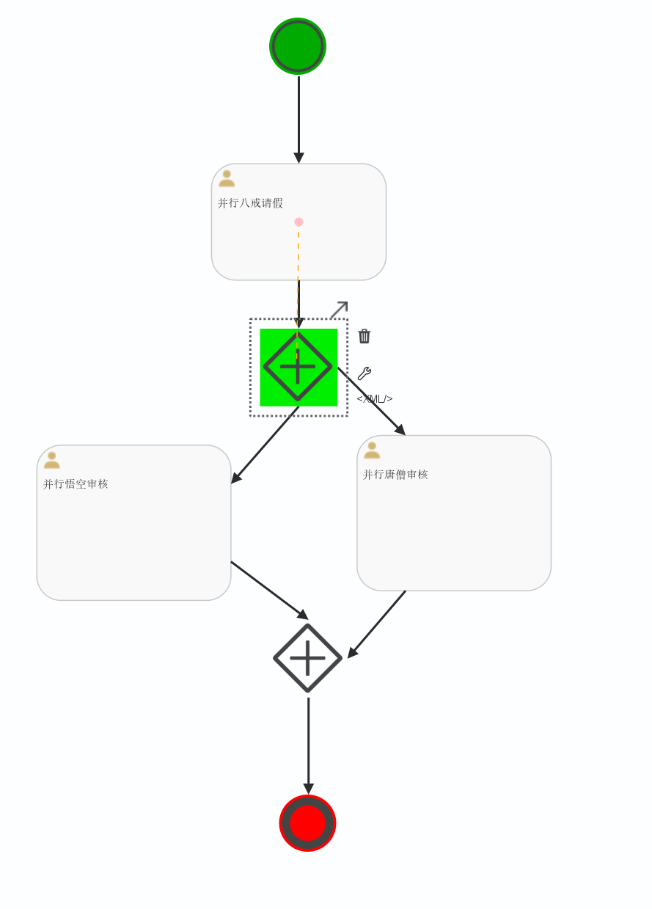
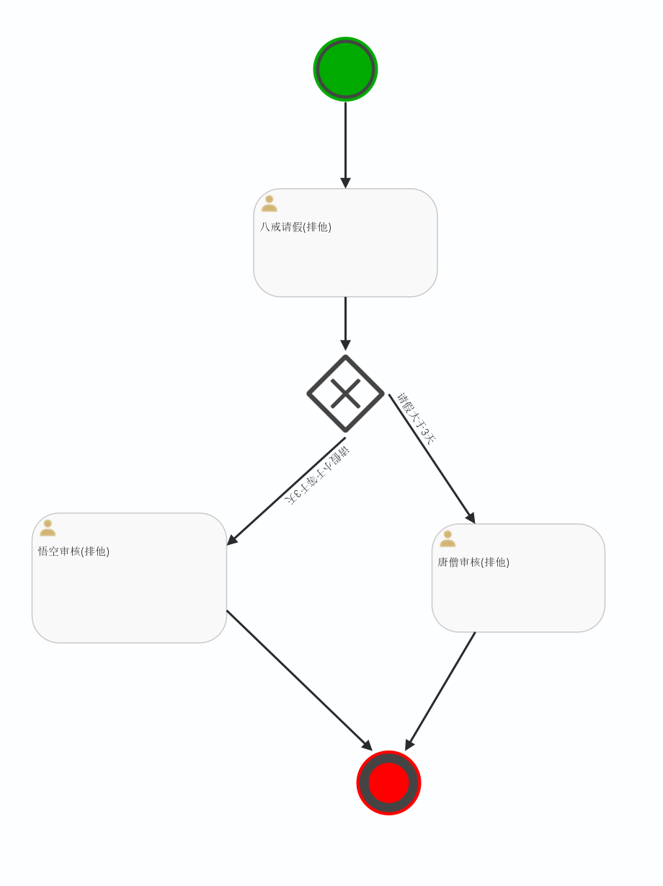
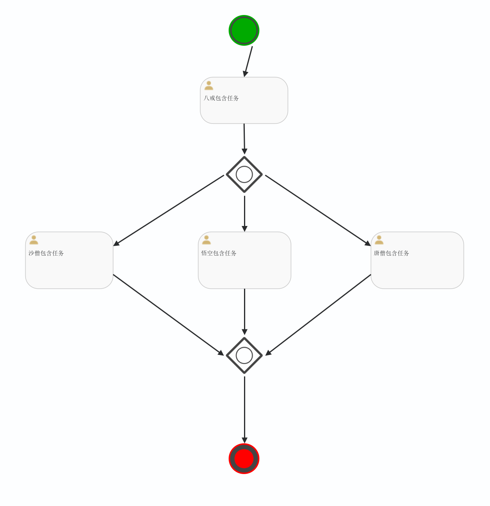

# Spring-Boot整合Activiti7
**工作流基础流程**

部署(Deployment) --->  流程定义(ProcessDefinition) ---> 初始化实例(ProcessInstance)  ---> 任务执行(Task)
## Deployment类

```java
   @Autowired
    private RepositoryService repositoryService;


    // 通过bpmn部署流程
    @Test
    public void initDeploymentBPMN() {
        String filename = "BPMN/Part1_Deployment.bpmn20.png";
        Deployment deployment = repositoryService.createDeployment()
                .addClasspathResource(filename)
//                .addClasspathResource("BPMN/Part1_Deployment.bpmn20.xml")
                .name("流程部署测试V2-BPMN")
                .deploy();
        System.out.println(deployment.getName());
    }

    // 通过zip部署流程
    @Test
    public void initDeploymentZIP() {
        String fileName = "BPMN/deployment.zip";
        InputStream fileInputStream = this.getClass()
                .getClassLoader()
                .getResourceAsStream(fileName);
        ZipInputStream zip = new ZipInputStream(fileInputStream);
        Deployment deployment = repositoryService.createDeployment()
                .addZipInputStream(zip)
                .name("流程部署zip")
                .deploy();
        System.out.println(deployment.getName());
    }

    // 查询流程部署
    @Test
    public void getDeployment() {
        List<Deployment> list = repositoryService.createDeploymentQuery().list();
        for (Deployment dep : list) {
            System.out.println("name: " + dep.getName());
            System.out.println("id: " + dep.getId());
            System.out.println("DeploymentTime: " + dep.getDeploymentTime());
            System.out.println("Key: " + dep.getKey());
        }
    }
```
## 流程定义ProcessDefinition
* Deployment: 添加资源文件、获取部署信息、部署时间
* ProcessDefinition: 获取版本号、key、资源名称、部署ID等
* ProcessDefinitionQuery: 查询流程定义
```java
    @Autowired
    private RepositoryService repositoryService;


    // 查询流程定义
    @Test
    public void getDeployment(){
        List<ProcessDefinition> list = repositoryService.createProcessDefinitionQuery()
                .list();
        for (ProcessDefinition pd : list){
            // 获取名字
            System.out.println("Name: "+pd.getName());
            // 获取key
            System.out.println("Key: "+pd.getKey());
            // 获取资源名称
            System.out.println("ResourceName: "+pd.getResourceName());
            // 获取id
            System.out.println("DeploymentId: "+pd.getDeploymentId());
            // 获取版本
            System.out.println("Version: "+pd.getVersion());
        }
    }
    
    // 删除流程定义
    @Test
    public void delDefinition(){
        String pdID = "a9b39f24-a54d-11ee-bcfc-782b46d17275";
        // 参数为true的话，删除所有流程实例，历史（删除所有历史记录）/ false 留痕
        repositoryService.deleteDeployment(pdID,true);
        System.out.println("删除流程定义成功");
    }
```

## 流程实例ProcessInstance
* ProcessInstance: 启动流程实例、获取流程实例ID、获取流程定义ID、获取流程定义Key、获取流程实例状态、获取流程实例
* ProcessDefinition 与 ProcessInstance 是一对多关系
```java
// 注入运行实例类
    @Autowired
    private RuntimeService runtimeService;

    // 初始化流程实例
    @Test
    void initProcessInstance() {
        ProcessInstance processInstance = runtimeService
                // 1. 获取页面表单内容、请假时间、请假事由、String、formData（个人业务表）
                // 2. fromData 写入业务表，返回业务表主键 ID == businessKey
                // 3. 把业务数据与 Activiti7流程数据关联
                .startProcessInstanceByKey("Part1_Deployment", "bKey001");
        System.out.println("流程实例ID：" + processInstance.getProcessDefinitionId());
    }

    // 获取流程实例列表
    @Test
    void getProcessInstance() {
        List<ProcessInstance> list = runtimeService.createProcessInstanceQuery().list();
        for (ProcessInstance pi : list) {
            System.out.println("-----流程实例----");
            System.out.println("ProcessInstanceId: " + pi.getProcessInstanceId());
            System.out.println("ProcessDefinitionId(): " + pi.getProcessDefinitionId());
            System.out.println("isEnded: " + pi.isEnded());
            System.out.println("isSuspended: " + pi.isSuspended());
        }
    }

    // 暂停与激活流程实例（单个）
    @Test
    void activitieProcessInstance() {
        // 挂起流程实例
//        runtimeService.suspendProcessInstanceById("1989127a-a559-11ee-bda5-782b46d17275");
//        System.out.println("挂起流程实例结束");
        // 激活流程实例
        runtimeService.activateProcessInstanceById("1989127a-a559-11ee-bda5-782b46d17275");
        System.out.println("激活流程实例结束");
    }

    // 删除流程实例（单个）
    @Test
    void deltProcessInstance() {
        // s 删除实例id   s1 删除理由
        runtimeService.deleteProcessInstance("1989127a-a559-11ee-bda5-782b46d17275", "删除");
        // 删除流程实例
        System.out.println("删除流程实例结束");
    }
```

## 任务Task
* Task: 获取任务ID、获取任务名称、获取任务创建时间、获取任务办理人、获取任务办理 

**用户属性面板**
* Assignee: 执行人/代理人
* Candidate Users: 候选人
* Candidate Groups: 候选组
* Due Date: 任务到期时间
```java
 @Autowired
    private TaskService taskService;

    // 任务查询
    @Test
    void getTasks(){
        List<Task> list = taskService.createTaskQuery().list();
        for (Task task : list){
            System.out.println("任务id: "+task.getId());
            System.out.println("环节名称：" + task.getName());
            System.out.println("任务执行人Assignee： "+task.getAssignee());
        }
    }

    // 查询我的代办任务
    @Test
    void getTasksByAssignee(){
        List<Task> list = taskService.createTaskQuery()
                .taskAssignee("八戒")
                .list();
        for (Task task : list){
            System.out.println("任务id："+task.getId());
            System.out.println("环节名称：" + task.getName());
            System.out.println("任务执行人Assignee： "+task.getAssignee());
        }
    }

    // 执行任务
    @Test
    void completeTask(){
        taskService.complete("9c884f2b-a566-11ee-8062-782b46d17275");
        System.out.println("完成任务");
    }

    // 拾取任务/归还任务 (候选人 --- 谁先拾取谁执行)
    @Test
    void claimTask(){
        Task task = taskService.createTaskQuery()
                .taskId("ccf41d15-a5e8-11ee-a30d-782b46d17275")
                .singleResult();
        //任务拾取
//        taskService.claim("ccf41d15-a5e8-11ee-a30d-782b46d17275","八戒");
//        System.out.println("任务拾取");

        // 任务归还 （s1  为null 归还任务， s1 为用户  交办任务）
        taskService.setAssignee("ccf41d15-a5e8-11ee-a30d-782b46d17275","悟空");

    }

```


## 查询历史记录
* 历史综合信息: HistoricTaskInstance
* 历史变量信息: HistoricVariableInstance
```java
   @Autowired
   private HistoryService historyService;

// 根据用户名查询历史记录
public void HistoricTaskInstanceByUser(){
    List<HistoricTaskInstance> list=historyService
        .createHistoricTaskInstanceQuery()
        .orderByHistoricTaskInstanceEndTime().asc()
        .taskAssignee("bajie")
        .list();
    for(HistoricTaskInstance hi:list){
        System.out.println("Id："+hi.getId());
        System.out.println("ProcessInstanceId："+hi.getProcessInstanceId());
        System.out.println("Name："+hi.getName());
    }
}

// 根据流程实例ID查询历史
public void HistoricTaskInstanceByPiID(){
    List<HistoricTaskInstance> list = historyService
        .createHistoricTaskInstanceQuery()
        .orderByHistoricTaskInstanceEndTime().asc()
        .processInstanceId("1f2314cb-cefa-11ea-84aa-dcfb4875e032")
        .list();
    for(HistoricTaskInstance hi : list){
        System.out.println("Id："+ hi.getId());
        System.out.println("ProcessInstanceId："+ hi.getProcessInstanceId());
        System.out.println("Name："+ hi.getName());
    }
}
```
# UEL 表达式
* 表达式描述以 "${"开始，以"}" 结束，例如 ${day>100}
* 支持逻辑运算 ${userName == "bajie" and pwd == "123"}
* 支持变量与实体类赋值 

对应Activiti数据表 
* act_ru_variable运行时参数表
* act_hi_varinst历史参数表 


```java
  /*
    注意不能使用驼峰命名
    必须实现序列化
     */
@Data
public class UEL_POJO implements Serializable {

    /*
    注意不能使用驼峰命名
     */
    private String zhixingren;

    private String pay;

}
```
# 网关

* 并行网关 不解析条件，不报错，都走 \
假设现在有这么一个场景，公司进行进行项目申报，需要走申报项目流程，待财务部门、采购部门、法律部门审批之后，再到老板审批，最后结束。
这过程中财务、采购、合同审批是可以并行处理的


* 排他网关  解析条件，要不报错要不走一个 \
 当流程执行到排他网关时，排他网关会选择第一条符合条件的路由走出去。

* 包含网关 解析条件，条件成立就走，不成立就不走，全都不成立报错 \
  包含网关可以看做是排他网关和并行网关的结合体。和排他网关一样，你可以在外出顺序流上定义条件，包含网关会解析它们。 但是主要的区别是包含网关可以选择多于一条顺序流，这和并行网关一样。
包含网关的功能是基于进入和外出顺序流的：
    * 分支：\
  所有外出顺序流的条件都会被解析，结果为true的顺序流会以并行方式继续执行， 会为每个顺序流创建一个分支。
    * 汇聚：\
  所有并行分支到达包含网关，会进入等待状态， 直到每个包含流程token的进入顺序流的分支都到达。 这是与并行网关的最大不同。换句话说，包含网关只会等待被选中执行了的进入顺序流。 在汇聚之后，流程会穿过包含网关继续执行。

* 事件网关 \
  事件网关只能连接到事件，并且连接的事件必须大于等于两个。


# Activiti 高级应用
* 边界事件
* 中间事件
* 子流程 