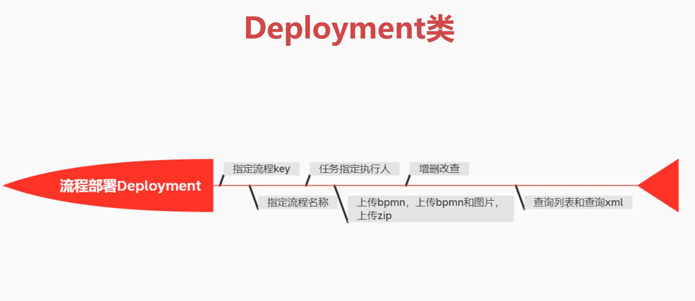

#  Spring-Boot整合Activiti7

## Deployment类

## 流程定义ProcessDefinition
* Deployment: 添加资源文件、获取部署信息、部署时间
* ProcessDefinition: 获取版本号、key、资源名称、部署ID等
* ProcessDefinitionQuery: 查询流程定义

## 流程实例ProcessInstance
* ProcessInstance: 启动流程实例、获取流程实例ID、获取流程定义ID、获取流程定义Key、获取流程实例状态、获取流程实例
* ProcessDefinition 与 ProcessInstance 是一对多关系